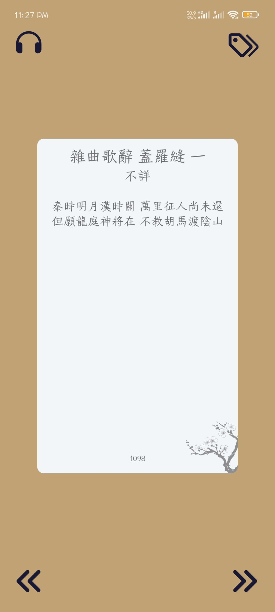

# 诗音

一个UI好看的诗词卡片应用。

感谢 [chinese-poetry: 最全中文诗歌古典文集数据库
](https://github.com/chinese-poetry/chinese-poetry) 提供的数据。

- [x] 支持唐诗三百首、宋词三百首、诗经、纳兰性德。
- [x] 随机刷新、历史回滚。
- [x] React Native + Sqlite。
- [ ] react-native-tts 暂不可用。暂不清楚不能播放的原因。

# 截图



# 部署

```
git clone --recurse-submodules git@github.com:shyu216/ShiYin.git

cd ShiYin

yarn install

yarn start

// in another terminal
yarn android

```